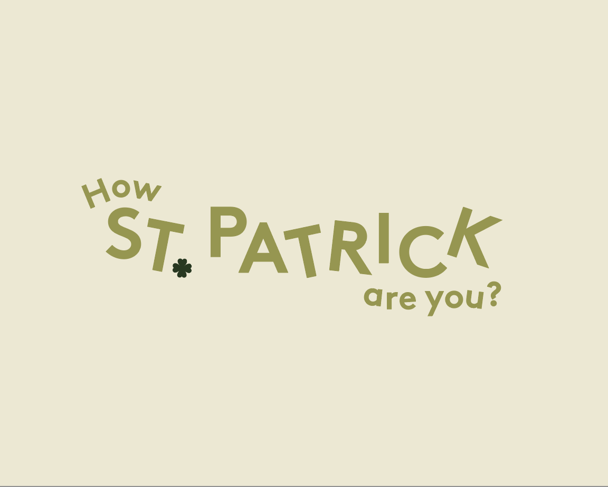

# How Patrick are you?

---

## Table of Contents:

- [What does it do and what does it need to fulfill?](#what-does-it-do-and-what-does-it-need-to-fulfill)
- [Functionality of Project](#functionality-of-project)
- [User Experience](#user-experience)
  - [User Stories](#user-stories)
  - [Design](#design)
    - [1. Font](#1-font)
    - [2. Color Scheme](#2-color-scheme)
    - [3. Logo](#3-logo)
    - [4. Wireframing & Proposed/Implemented Functionality per Page](#4-wireframing--proposedimplemented-functionality-per-page)
- [Technology Used](#technology-used)
- [Database](#database)
- [Features](#features)
  - [Future Features](#future-features)
  - [Common styling](#common-styling)
    * [Navbar](#navbar)
    * [Footer](#footer)
  - [Home page](#home-page)
  - [Quiz](#quiz)
  - [Leaderboard](#leaderboard)
  - [Accessability](#accessability)
  - [Privacy policy](#privacy-policy)

- [Testing](#testing)
  - [Found Bugs & Fixes](#found-bugs--fixes)
- [Deployment](#deployment)
- [Credits](#credits)
  - [Special Thanks & Acknowledgements](#special-thanks--acknowledgements)

---

## Welcome to our Hackathon Project: How Patrick are you?

<p align="center">
    
</p>

---

## What does it do and what does it need to fulfill?

This project is a collaborative effort from team `Callback(Patrick)`, for the March 2021 Code Institute Hackathon. This project is based on the theme of bringing people together during the Covid Pandemic for St.Patrick's Day 2021, as a Quiz with an emphasis on humor and laughter for the whole family comparing the User and their proposed answers to that of the main man himself...aul St.Pat!

The team consists of the following developers, for which, without them this project would not have been possible:
*  <a href="https://github.com/Jade-Quinn">Jade Quinn</a>
*  <a href="https://github.com/maelou363">Lindsay Garza</a>
*  <a href="https://github.com/kenwilde1">Kenny Wilde</a>
*  <a href="https://github.com/Mr-Smyth">Eamonn Smyth</a>
*  <a href="https://github.com/auxfuse">Anthony O' Brien</a>

### Functionality of Project

This web application utilises a smaller tech stack then the norm in the form of HTML/CSS/JS/Bulma/Firebase to ensure that the project had ample scope to suit the timeframe available of the hackathon.

The project encompasses the use of Git & Github in a team setting using Forks/Branches/Pull Requests/Upstream Pulls etc to allow each developer on the team have some hands-on experience of a team building environment via version control. This allowed for increased security over the main upstream repository, for which this project's source code and is deployed through, and allowed each developer to have singular experience in reviewing/approving/merging Pull Requests as collaborators on this project. Again utilising this approach allowed each of us to bolster knowledge or even learn new things along the way!

Firebase was utilised to host the Questions & Answers and Leaderboard rankings away from the source code, removing the _ability_ to cheat. A Backend-as-a-Service (BaaS) allowed the projects complexity to be drastically reduced as it removed the time consuming efforts of a bespoke backend and configuring same. Technically outsourcing the responsibility of maintaining and managing a typical backend and allowing us as developers to focus our efforts on the Frontend.

Bulma was used as a new CSS Framework for the structuring and layout of the project. It is lightweight, comes with a suite of well written documentation and more importantly does not contain a Javascript inclusion dependency. Which meant we as a team again had freedom to add custom JS to the interactive components needed fortifying our knowledge and skills with the language. The framework is mobile first and works similar to Bootstrap meaning our previous knowledge learned on the course came to great benefit.

[Back to top](#table-of-contents)

## User Experience:

#### User Stories:

_Generic (Guest/Public) User:_
* As a Generic User, I want to be able to view the site on any device I may have, (mobile/tablet/desktop).
* As a Generic User, I want to have the ability to view the established Accessibility Statement & Privacy Policy if any.
* As a Generic User, I want to have the ability to play the game.
* As a Generic User, I want to have the ability to view a leaderboard to see how I compared against others.
* As a Generic User, I want to have the ability to navigate between pages seemlessly and easily.
* As a Generic User, I want to have the ability to play a mobile friendly game to pass some time while on the go.

_Developer:_
* As a developer, I want to create fully responsive app to showcase my skills to a potential employer.
* As a developer, I want an on-going project I can enhance and improve over time as my skills grow.
* As a developer, I want to imporve on my existing skills using HTML/CSS/JS.
* As a developer, I want to use new languages/tools/services to promote and compliment my exisiting knowledge and competencies.
* As a developer, I want to create secrets and easter eggs in the project adding to the overall experience of the project to the user.
* As a developer, I want to work comprehensively with Git/Github attributing to my overall competency of this globally used professional version controlling tool.
* As a developer, I want to work in a team to enhance my communication skills.
* As a developer, I want the experience of working in sprints with an impending closing deadline giving me the potential to learn proactively to problems as they arise.

#### Design

##### 1. Font

Throughout this project the below fonts are used to promote a friendly and appealing nature. Both fonts are sans serif typefaces, with a backup font of `sans-serif`, in case of any particular font not rendering as expected. They both greatly compliment each other, with "Luckiest Guy" giving a 1950s advertisement custom hand lettering feel for our headers and "Poppins" bringing a more geometric sans-serif typeface allowing for increased human readability and enhanced eye-tracking on screens.

- Headings - <a href="https://fonts.google.com/specimen/Luckiest+Guy?preview.text_type=custom">Luckiest Guy</a>
- Body - <a href="https://fonts.google.com/specimen/Poppins?preview.text_type=custom">Poppins</a>

##### 2. Color Scheme

Our color scheme is inspired by St.Patrick's day and muted tones. Allowing for constrating elements to be defined by the user with ease and promoting good User Experience amongst the site.

-  `#2a3719` - Primary color
-  `#5f6c39` - Secondary color
-  `#ddd5ba` - Tertiary color
-  `#e04b32` - Supplementary color
-  `#cd8741` - Supplementary color 2

##### 3. Logo

<p align="center">
    
</p>

##### 4. Wireframing & Proposed/Implemented Functionality per Page

Wireframes for this project were created using Sketch, for small and large viewports. Each element was structurally planned out before building the project to allow us to build to a plan saving on time and potential bottlenecking via scope creep.

<details>
<summary>Wireframes</summary>

<p align="center">
    
</p>
<p align="center">
    
</p>
<p align="center">
    
</p>
<p align="center">
    
</p>

</details>

[Back to Top](#table-of-contents)

## Technology Used

#### Languages, Frameworks, Editors & Version Control:

* HTML/CSS/JS ~ core languages used to build this site.
* Firebase ~ BaaS used to store Questions&Answers and Leaderboard results for population to the site and to itself from the site.
* Bulma ~ Pure CSS Component Frontend framework for layout and overall fronend architecture.
* Gitpod/vsCode/PyCharm ~ preferred used editors/IDEs to develop the project.
* Git ~ installed on local machines or default built into Gitpod.
* Github ~ used to host the repository and version control the site, aswell as used for deployment of the project.

#### Tools Used:

* W3C HTML Validator / W3C CSS Validator / JSHint ~ Used to check the validity and efficiency of the code base.
* Autoprefixer CSS Online ~ Used to check for possible webkits required in the applications stylesheet ensuring Cross-browser support.
* Font Awesome Icons ~ For iconography not custom to the site.
* Sketch ~ Used to create the wireframes.
* Illustrator ~ Used to create the custom logos and icons.
* tinypng.com ~ Used to compress images used throughout the site without affecting image integrity/quality.

<p align="center">
    
</p>

## Database


Google's Firebase was used as a backend-as-a-service. Specifically, Cloud Firestore was used as a Cloud Database. It is a NoSQL, document-oriented database.

It was used for two collections of data `leaderboard` and `questions-and-answers`.

#### Data Model:

As mentioned before, two collections of data were stored on Cloud Firestore. Firestore uses JSON model (under the hood) to store it's data and is as follows:

`collection` --> `document` --> `fields`

##### Leaderboard

For the leaderboard, it only had one Document - Scores. This document contained all user names and their subsequent scores.

Here is how its modelled:

```
 leaderboard { // collection
     scores: { // document
        "John Smith": 80, // field
        "Jane Doe": 80, // field
        ..
        ..
        ..
    }
}
```

As scores are added to the document over time, it must be sorted for the leaderboard - this is handled client side in [leadboard.js](https://github.com/auxfuse/how-patrick-are-you/blob/main/assets/js/leaderboard.js) on `line: 22`.

##### Questions and Answers

It was important to have a backend such as Cloud Firestore to store the Answers as to prevent people from using Dev Tools to find the correct answers. The Questions were stored alongside them for convenience. It had a Document per Question (10 in total).

Here is how its modelled:

```
questions-and-answers { // collection
    questionOne: { // document
        answers: [ // field
            choiceOne,
            choiceTwo,
            choiceThree,
            choiceFour,
        ],
        correctIndex: 2, // field
        explained: "explanation text", // field
    },
    ..
    ..
    ..
    questionTen: { // document
        answers: [ // field
            choiceOne,
            choiceTwo,
            choiceThree,
            choiceFour,
        ],
        correctIndex: 0, // field
        explained: "explanation text", // field
    },
}
```

## Features

### Common styling

Responsive pages containing a site common navbar and footer.   

#### Navbar

**Contains:**

+ site logo as home link.
+ links to Home, the quiz and the leaderboard.

The navbar collapses at the Tablet scren size, condensing the menu options into a dropdown menu.

#### Footer

**Contains:**

+ Link to privacy policy
+ Social media links
+ Link to Accessibility

### Home page

**Contains:**

+ A styled responsive banner image.
+ A How to play dropdown instructions meny - with common site styling.
+ A call to action button to begin the quiz.

### Quiz

**Contains:**

+ A list of 10 questions to judge how like st. Patrick you are.
+ The questions are supplied to the user one-by-one, as the user clicks and submits his answer.
+ The scores are then calculated and the user is given a result.
+ The user is then able to enter their name and add their score to a leaderboard.
+ oh and theres that thing.

### Leaderboard

**Contains:**

+ A list of the top 10 people who played the quiz.
+ The data is provided via Firebase.

### Accessability

**Contains:**

+ Accessability details.

### Privacy policy

**Contains:**

+ Privacy policy details.

[Back to Top](#table-of-contents)

#### Future Features:

* Share functionality for the user to share their score with friends and family.
* Difficulty setting, dependent on age group.
* User Custom quiz creation.

## Testing

#### Found Bugs & Fixes:

[Back to Top](#table-of-contents)

## Deployment

This application was developed in multiple editors, Gitpod/vsCode/PyCharm, and version controlling was utilised via local (git) and online (github) repository technologies.

Deploying this application was achieved through Github pages by:

* Selecting the Repository from my list in the Github Dashboard.
* Navigating to "Settings" and to the "Github Pages" section.
* From the "Source" section, click on the dropdown and select "main" branch from the associated list.
* Once "main" branch is selected, the page will auto-refresh and navigate the user to the top of the page with a visual ribbon display detailing, "Github pages source saved", indicating the success of the deployment.
* The link to the website can then be found under the "Github Pages" section, with a ribbon notification stating:
    "Your site is published at "https://<username>.github.io/<repo-name>/"


To clone the website:

Select the Repository from the Github Dashboard.
* Click on the "Clone or download" green button located above and to the right of the "Add file" button.
* Click on the "clipboard icon" to the right of the Git URL to copy the web URL of the Clone.
* Open your preferred editor/IDE and navigate to the terminal window.
* Type `git clone <paste-clone-url-here>` and press "Enter/Return" on your keyboard.
* This will create a clone of the project for you.

## Credits

[Back to Top](#table-of-contents)

#### Special Thanks & Acknowledgements:

This project and the workings of this project was an incredible experience. I truly enjoy getting to know people and learning from them. The level of knowledge and professional experience from my colleagues has been truly inspiring and one I won't soon forget. From a team perspective I couldn't have asked for greater people. Humble, willing with their time and relatable....each person has brought to this team strengths which I lacked both as a developer and as a person and allowed me to situate myself in a position to bolster my confidence and broaden my competencies. Whatever the outcome, I'm proud of us. I am very grateful for this experience, and thank you all for your hard work! 🤜 
-- Anthony

###### <i>Disclaimer: This project was created for educational use only as part of the Code Institute 2021 March Hackathon!</i>

[Back to Top](#table-of-contents)

<p align="center">
    
</p>
